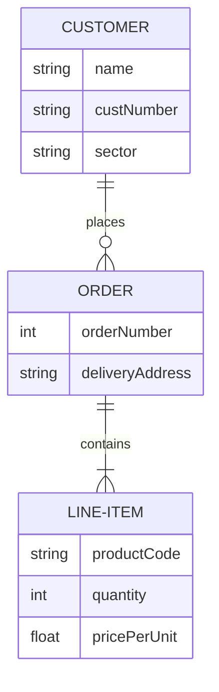

# Gestor de biblioteca

### Este es un gestor de biblioteca simple el cual va a <b>añadir</b>/<b>modificar</b>/<b>eliminar</b> libros dela biblioteca 

```mermaid
erDiagram
    CUSTOMER ||--o{ ORDER : places
    CUSTOMER {
        string name
        string custNumber
        string sector
    }
    ORDER ||--|{ LINE-ITEM : contains
    ORDER {
        int orderNumber
        string deliveryAddress
    }
    LINE-ITEM {
        string productCode
        int quantity
        float pricePerUnit
    }
```